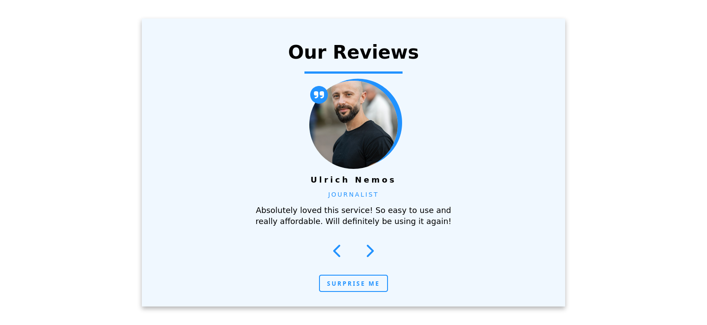

# Review App

An app that allows the user to navigate through other users' reviews.

## Screenshot 

## Features

- Navigation buttons to scroll reviews left, and right.
- 'Surprise me' button to get random reviews.

## Installation

1. Clone the repository: `git clone https://github.com/AlexdelCarmen/review-app`
2. Open the `index.html` file in your web browser.

## Usage

Use the left and right buttons to navigate through other users' reviews. Click on the 'Surprise me' button to get random reviews.

## Technologies

Made with:

- HTML
- CSS
- JavaScript

## License

This project is released under the Unlicense. Please read the LICENSE file [License](./LICENSE).

## Credits

Inspired in John Smilga's video for freeCodeCamp `https://youtu.be/3PHXvlpOkf4`
